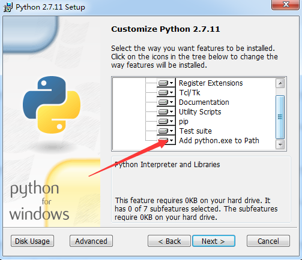

# ETENG-WIKI构建说明
## 发布方式

* 利用MKDocs 在github 发布

# 快速开始,贡献一个wiki

##安装

* 安装python[点击下载2.7](https://www.python.org/ftp/python/2.7.11/python-2.7.11.msi)
MkDocs 支持 Python 2.6, 2.7, 3.3, 3.4,3.5 现在最好先用2.7

```
$ python --version
Python 2.7.2
$ pip --version
pip 1.5.2
```
	
* 用pip安装mkdocs:

```
pip install mkdocs
$ mkdocs --version
mkdocs, version 0.15.2
```
	
------------------------------------
## 贡献给一个wiki 
 首先加入 __易腾知识库__ 这个组织 ,[__联系我们__](contact.md)  
 例如我贡献ETENG-WIKI这个项目

``` 
git clone https://github.com/ETENG-WIKI/ETENG-WIKI.git
cd	ETENG-WIKI
mkdocs serve
```

在浏览器中 Running at: http://127.0.0.1:8000/ 就可看到现在的效果 

增加一页   在docs 中新建***.md  
__mkdocs.yml__ 增加配置指向

在***.md 中编写即可 
## 发布 
  
* 通过mkdocs github发布

```
mkdocs gh-deploy --clean
```


## MKDocs 配置

### Project layout

    mkdocs.yml    # The configuration file.
    docs/
        index.md  # The documentation homepage.
        ...       # Other markdown pages, images and other files.
       
 通过__mkdocs.yml__配置标题,主题和目录结构
 
	site_name: 易腾WIKI列表
	pages:
	- Home: index.md
	- About: about-wiki.md
	- Start: start.md
	- Contact: contact.md
	theme: readthedocs
   

# MkDocs doc 
For full documentation visit [mkdocs.org](http://mkdocs.org).


待续.......... 累了

